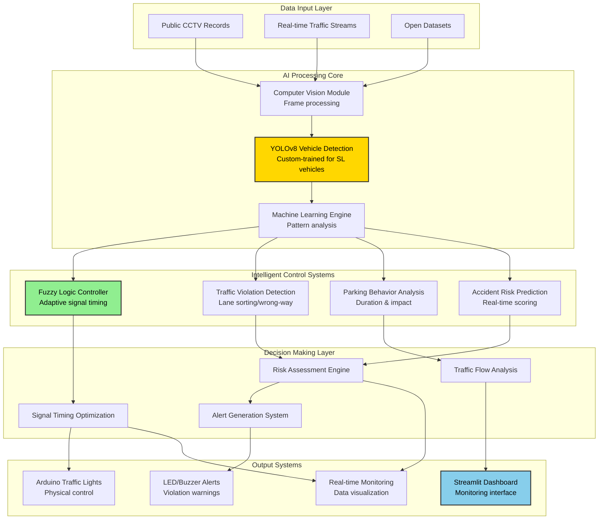

# Intelligent Traffic Management System for Sri Lanka

An intelligent system using Machine Learning and Fuzzy Logic to improve traffic flow and safety in Sri Lankan cities.

[](https://opensource.org/licenses/MIT)
[](https://www.python.org/downloads/)
[](https://flutter.dev/)

---

## 📑 Table of Contents

- [Project Overview](#-project-overview)
- [System Architecture](#%EF%B8%8F-system-architecture)
- [Team Contributions](#-team-contributions)
- [Commercial Potential](#-commercial-potential)
- [Features](#-features)
- [Dependencies](#-dependencies)
- [Installation](#-installation)
- [Project Structure](#-project-structure)
- [License](#-license)

---

## 🎯 Project Overview

Sri Lanka's cities face severe traffic congestion from outdated signal systems unable to adapt to unique local traffic patterns, such as the mix of tuk-tuks and buses. This project introduces a prototype system that uses real-time video analysis to create an adaptive, efficient, and safe traffic management solution.

### Key Objectives

1.  **Real-time Vehicle Detection and Classification** - Custom YOLOv8 models trained on Sri Lankan traffic images.
2.  **Adaptive Traffic Signal Control** - Fuzzy logic-driven signal timing optimization.
3.  **Traffic Violation and Risk Monitoring** - Behavioral analysis and parking violation detection.
4.  **Integrated Dashboard and Alert System** - Real-time monitoring and physical alerts.

### Problem Statement

-   **Outdated Systems**: Static traffic signals unable to adapt to changing conditions.
-   **Foreign Algorithms**: Failing to detect local vehicle mix (tuk-tuks, overloaded buses).
-   **No Real-time Adaptation**: Absence of dynamic response to traffic patterns.
-   **Safety Concerns**: Increased accident rates due to congestion and unregulated parking.

---

## 🏗️ System Architecture



### Architecture Overview

1.  **Data Acquisition**: Live camera feeds capture real-time traffic conditions at junctions.
2.  **Vehicle Detection**: YOLOv8 models identify and classify vehicles, violations, and parking behavior.
3.  **Fuzzy Logic Processing**: Controller analyzes traffic patterns and determines optimal signal timings.
4.  **Signal Control & Alerts**: Adaptive signaling implemented with Arduino-based warning systems.

---

## 👥 Team Contributions

| Component | Member Name | Student ID |
|-----------|-------------|------------|
| **Component 1**<br>Parking Behaviour & Traffic Impact Analysis | **Gunarathna R.P** | IT22925572 |
| **Component 2**<br>Smart Traffic Violation Detection | **Randima K.M.G.D** | IT22900890 |
| **Component 3**<br>Fuzzy Logic Controller | **Tennakoon I.M.S.R** | IT22363848 |
| **Component 4**<br>Accident Risk Prediction and Integrated Dashboard | **Palihakkara P.I** | IT22337580 |

---

## 📊 Commercial Potential

| User Type | Benefits | Commercial Potential |
|-----------|----------|----------------------|
| **Municipal Councils** | Reduced congestion & automated traffic flow management. | **High**: Scalable for smart city infrastructure. |
| **Traffic Police** | Real-time violation alerts & automated evidence collection. | **Medium**: Integration with law enforcement systems. |
| **Urban Planners** | Data-driven insights into parking and traffic bottlenecks. | **High**: Valuable for long-term infrastructure ROI. |
| **Emergency Services** | Priority routing for ambulances and fire trucks. | **Critical**: Essential for public safety services. |
| **Smart Traffic Management Providers** | Real-time risk analytics for proactive accident prevention. | **High**: Can be offered as a subscription-based analytics service. |


---

## ✨ Features

### Component 1: Parking Behaviour & Traffic Impact Analysis
**Lead:** Gunarathna R.P

-   **Real-time Parking Detection**: Custom YOLOv8 model detects parked vehicles and roadside activity.
-   **Duration Tracking**: DeepSORT algorithm estimates parking duration.
-   **Illegal Parking Detection**: Identifies violations in designated no-parking zones.
-   **Traffic Impact Analysis**: Calculates flow disruption from roadside parking.
-   **Dashboard Integration**: Real-time data feed to central monitoring.

### Component 2: Smart Traffic Violation Detection
**Lead:** Randima K.M.G.D (IT22900890)

-   **Behavioral Detection**: Lane weaving, wrong-way driving, improper stopping.
-   **Risk Assessment**: Context-aware severity scoring.
-   **Pattern Recognition**: Repeat offender identification.

### Component 3: Fuzzy Logic Controller
**Lead:** Tennakoon I.M.S.R (IT22363848)

-   **Real-time Optimization**: Dynamic signal timing based on vehicle density.
-   **Emergency Priority**: Instant routing for ambulances/fire trucks.
-   **Multi-input Processing**: Vehicle counts, parking data, violations.

### Component 4: Accident Risk Prediction and Integrated Dashboard
**Lead:** Palihakkara P.I (IT22337580)

-   **Predictive Risk Scoring**: Multi-factor accident likelihood calculation.
-   **Real-Time Vehicle Analysis: Monitors each vehicle’s movement and speed continuously.
-   **Behavior-Based Risk Detection: Identifies unsafe driving patterns and violations.
-   **Traffic Heatmaps**: Visual congestion and risk mapping.
-  **Risk Level Classification: Categorizes vehicles into Low, Medium, High, and Critical risk levels.
---

## 📦 Dependencies

### Backend (Python/AI)
```txt
# Core
python==3.11+
fastapi==0.104.1
uvicorn==0.24.0

# Computer Vision & ML
opencv-python==4.8.1.78
ultralytics==8.0.208            # YOLOv8
torch==2.1.0
torchvision==0.16.0

# Tracking & Processing
deep-sort-realtime==1.3.2
scikit-fuzzy==0.4.2
numpy==1.26.2
pillow==10.1.0
```

### Mobile App (Android) ⚠️ IMPORTANT
| Requirement | Version | Notes |
|-------------|---------|-------|
| **Flutter SDK** | 3.16+ | With Dart 3.2+ |
| **Android Studio** | 2023.1+ | Required for SDK tools |
| **Android SDK** | API Level 34 | Required |
| **Android NDK** | **23.1.7779620** | ⚠️ **EXACT VERSION** |
| **Java** | 17 | Bundled with Android Studio |

---

## 🚀 Installation

### Prerequisites

-   **Python 3.10+**
-   **Flutter SDK 3.16+**
-   **Git**

### Setup Instructions

1.  **Clone the repository**
    ```bash
    git clone https://github.com/RP1999/Intelligent-Traffic-System.git
    cd Intelligent-Traffic-System
    ```

2.  **Backend Setup**
    ```bash
    # Create virtual environment
    python -m venv .venv
    
    # Activate (Windows)
    .\.venv\Scripts\Activate.ps1
    # Activate (Mac/Linux)
    source .venv/bin/activate

    # Install dependencies
    cd backend
    pip install -r requirements.txt
    ```

3.  **Frontend Setup**
    ```bash
    cd ../frontend
    flutter pub get
    ```

4.  **Run the System**
    
    *Backend:*
    ```bash
    # From project root
    ./start_backend.sh
    # OR manually
    uvicorn app.main:app --reload --host 0.0.0.0 --port 8000
    ```

    *Frontend:*
    ```bash
    # From frontend directory
    flutter run -d chrome --web-port 3000
    ```

---

## 📂 Project Structure

```
Intelligent-Traffic-System/
├── backend/
│   ├── app/
│   │   ├── main.py                # API Entry point
│   │   ├── detection/             # YOLO & DeepSORT logic
│   │   ├── parking/               # Parking analysis module
│   │   └── routers/               # API endpoints
│   ├── requirements.txt           # Python dependencies
│   └── check_db.py                # Database verification
├── frontend/
│   ├── lib/
│   │   ├── main.dart              # App Entry point
│   │   ├── screens/               # UI Screens (Dashboard, Login)
│   │   ├── widgets/               # Reusable components
│   │   └── providers/             # State management
│   ├── pubspec.yaml               # Flutter dependencies
│   └── web/                       # Web build artifacts
├── data/                          # Models and sample footage
└── README.md                      # This documentation
```

---

## 📄 License

This project is licensed under the MIT License - see the [LICENSE](LICENSE) file for details.

---

## 📧 Contact

**Project Lead:** Gunarathna R.P  
**Institution:** Sri Lanka Institute of Information Technology (SLIIT)

